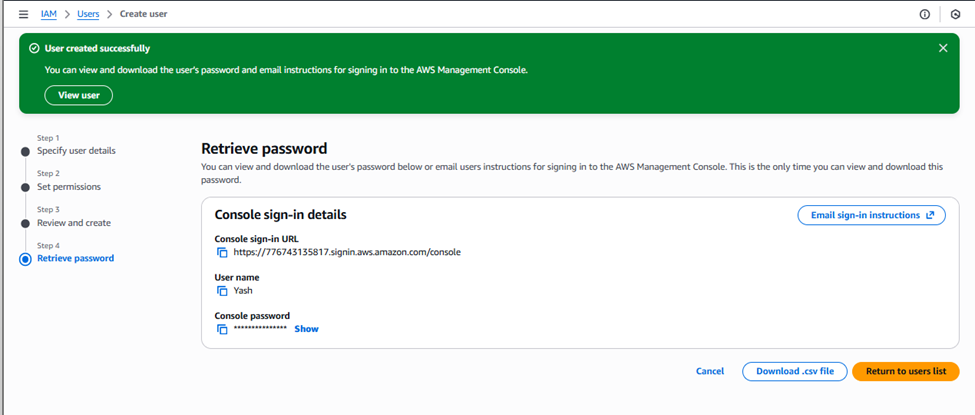

# AWS IAM User and S3 Access Policy Configuration

This project demonstrates how to create and manage **S3 Buckets** and configure **IAM Policies and Users** in AWS to grant specific permissions.  
The goal is to understand how IAM access control works by allowing a user to list S3 buckets while restricting access to EC2 resources.

---

## Architecture Overview

This setup focuses on **Identity and Access Management (IAM)** and **Amazon S3** interaction:

- Two **S3 Buckets** are created under the same AWS account.
- A **custom IAM Policy** is created to allow only list access to S3 buckets.
- A new **IAM User** is created and assigned this policy.
- The user can view bucket lists but cannot delete them or access EC2 instances.

This demonstrates **fine-grained access control** through AWS IAM and helps understand **principle of least privilege**.

---

## Prerequisites

- AWS Management Console access
- IAM and S3 permissions on your AWS account
- Basic understanding of IAM policies and JSON syntax

---

## 1. Create S3 Buckets

1. Go to **AWS Console → S3 → Create Bucket**
2. Enter a **globally unique name** for the bucket (e.g., `my-demo-bucket-01`)

3. Keep all settings default and click **Create bucket**
4. Repeat the process to create **two more buckets** with unique names

---

## 2. Create IAM Policy

1. Go to **IAM → Policies → Create Policy**
2. Under **Specify Service**, choose **S3**
3. Select **Effect: Allow**
4. Under **Actions**, select **ListAllMyBuckets** or **All List Access**

5. Leave resources as `All` (for demo purposes)
6. Review the policy and give it a name, e.g.,`Custom-Bucket-Policy`

7. Click **Create Policy**

---

## 3. Create IAM User

1. Go to **IAM → Users → Create User**
2. Enter a username, e.g., `Yash`
3. Under **Access Type**, select:

   - **AWS Management Console Access**
   - Choose **Custom Password**
   - Keep “User must create a new password at next sign-in” checked
4. Under **Permissions**, select **Attach policies directly**
5. Filter by **Customer Managed Policies** and select `Custom-Bucket-Policy`

6. Review and click **Create User**

7. Download the **.csv file** containing:

   - Username
   - Password
   - Sign-in URL

---

## 4. Sign In and Test Access

1. Open the **Sign-in URL** from the CSV file in a browser
2. Enter credentials and **create a new password** when prompted

3. Once logged in:
   - Go to **S3 Service**
   - You will see all buckets listed successfully
   

   - Try deleting a bucket — it will fail due to limited permissions
   

   - Go to **EC2 Service** — access will be denied since no EC2 permissions were granted
   

---

## 5. Verify Policy Attachment

1. In the AWS Console, navigate to **IAM → Users**
2. Select the user you created
3. Under **Permissions Tab**, verify that **Custom-Bucket-Policy** is attached

4. Review the policy details to confirm the scope of access

---

## Summary

| Component     | Purpose                                         |
|----------------|-------------------------------------------------|
| S3 Buckets     | Store and test data access                     |
| IAM Policy     | Grants limited S3 list access only              |
| IAM User       | Demonstrates access control implementation      |
| EC2 Service    | Restricted access (denied) for the IAM user     |

---

## Learning Outcome

This project helps understand:
- How IAM Policies control access at a granular level  
- Difference between **allowed** and **denied** permissions  
- Importance of **principle of least privilege** in AWS IAM  
- How to test IAM access through the AWS Management Console  

---

## Contact

**Author:** Kunal Shinde  
**Email:** [kunalshinde066@gmail.com](mailto:kunalshinde066@gmail.com)  
**LinkedIn:** [https://www.linkedin.com/in/kunal-shinde-1b17a2205](https://www.linkedin.com/in/kunal-shinde-1b17a2205)  
